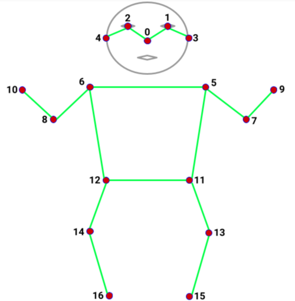

# Pushup counter in react-native

Mobile app that uses react-native, expo and TensorFlow to do a user pose detection and count how many pushups have been made.

## Detection

The detection is done through TensorFlow's Movenet model which detects 17 keypoints.

After detecting the skeleton a set of conditions like arm and leg angles needs to be verified in order to count a pushup with correct posture.

(skeleton_with_angles)

# Work in Progress